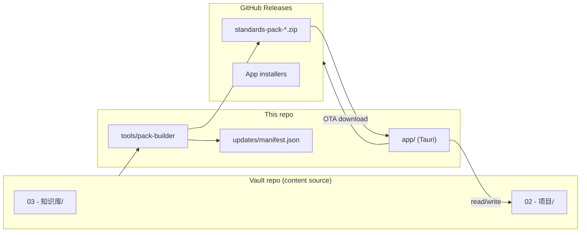
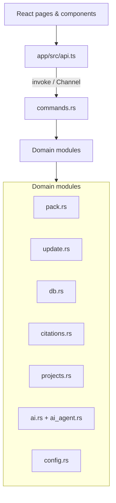
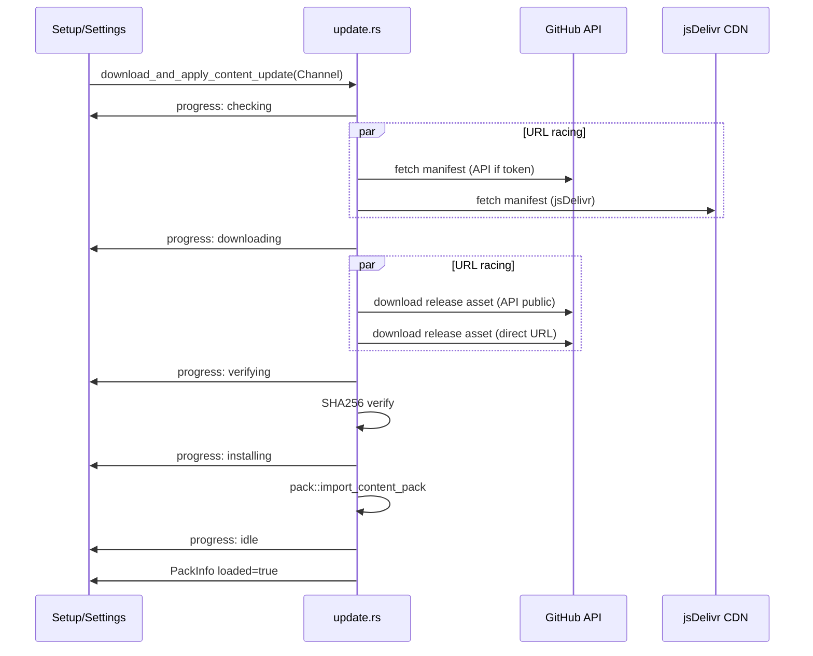

# Architecture — Accounting Copilot

Concise map for developers and agents. Full product spec: [DESIGN.md](./DESIGN.md).

## System context



## App runtime layers



## First-run vs steady state

| State | `pack.loaded` | UI |
|-------|---------------|-----|
| First install | `false` | Setup wizard (download pack) |
| Ready | `true` | Workbench + Standards tabs |

Settings (gear icon) is always available from the header.

## Update download pipeline



Key file: `app/src-tauri/src/update.rs`. Both manifest fetch and pack download use `futures_util::future::select` to race URLs — the fastest successful response wins. `api.github.com` is used without token for public repos (accessible from mainland China). Config supports `manifest_url_alt` and `pack_url_alt` for future CDN mirrors.

## Standards data on disk (installed pack)

After import, `content/` contains:

```
content/
├── registry.json           # standards list + counts
├── pack-manifest.json
├── current/                # active standards markdown
├── archive/                # legacy standards
├── index/
│   └── paragraphs.json     # citation / paragraph index
└── writing-spec/           # AI writing guidelines
```

Search uses SQLite FTS5 populated from pack content (`db.rs`). Note: `standard_id` is UNINDEXED in FTS5 schema — `generate_project_document` fallback searches `registry.json` for exact/substring ID matches (e.g. searching "IFRS 11" bypasses FTS5 limitation).

Search results enriched with `framework` and `status` from registry when available.

## AI generation progress events

```
Rust (ai_agent.rs)                  Frontend (App.tsx)
    │                                     │
    │  emit("ai-generation-progress",     │
    │    {phase:"searching", msg:"..."})  │
    ├───────────────────────────────────►│ listen() → setGenProgress()
    │                                     │
    │  emit("ai-generation-progress",     │
    │    {phase:"generating", msg:"..."}) │
    ├───────────────────────────────────►│
    │                                     │
    │  emit("ai-generation-progress",     │
    │    {phase:"complete", msg:"path"})  │
    ├───────────────────────────────────►│ setGenResultPath() → reload tree
    │                                     │
    │  emit("ai-generation-progress",     │  (or on error: setGenError())
    │    {phase:"error", msg:"reason"})   │
    └───────────────────────────────────►│
```

Events are global (not tied to component lifecycle). Switching tabs does not interrupt generation.

## Conversation tracking pipeline

```
get_project_conversation(relative_path)
  │
  ├── Source A: stored (ai_threads[path] in config.json)     ← real timestamps (now_secs)
  ├── Source B: session_activity (ai_agent_sessions[path])   ← parsed from agent messages
  └── Source C: markdown_turns (parsed from .md file)         ← log section + question section
       │
       ├── extract_turns_from_log_section: uses find_exact_heading("## 日志")
       │     Timestamps from parse_log_date_to_secs (real dates)
       └── extract_turns_from_question_section: uses find_exact_heading("## 问题")
             Skips sections with ### sub-headings (AI-generated structured content)
       
  merge_conversation_sources: A > B > C, supplement missing user rounds
  
  Log dedup: strip_trailing_log_section() removes AI-generated log before append_log_for_turn()
```

## Frontend page responsibilities

| Page | File | Role |
|------|------|------|
| Setup | `SetupPage.tsx` | Token, first download, 3-step onboarding |
| Standards | `StandardsPage.tsx` | Browse/search standards, filters, in-document find |
| Workbench | `EvidencePage.tsx` | Project notes, side panel, AI threads, mermaid rendering |
| Settings | `SettingsPage.tsx` | Projects dir, AI, updates, version info |

Navigation shell: `App.tsx`.

### In-document search (`useBodySearch` hook + `BodySearchBar`)

Integrated into `StandardDetailPanel` and `EvidenceStandardPanel`. Uses DOM TreeWalker to highlight matching text nodes with `<mark>` elements. Debounced (250ms), case-insensitive, with previous/next navigation and match counter. Fail-safe: citation highlighting (HighlightedBody) coexists with search marks.

### Mermaid diagram rendering (`MermaidBlock`)

Lazy-loaded via `React.lazy()`. Detects `language-mermaid` fenced code blocks in `MarkdownPreview`. Uses `securityLevel: "loose"` for HTML-in-label support (e.g. `<br>`). Fullwidth Unicode characters (：？！) are normalized to ASCII. `suppressErrorRendering: true` + SVG error-pattern detection prevent error text from appearing on page. Render failures silently fall back to a plain code block.

### Logo

`Wordmark.tsx` exports `BrandMark` SVG (navy #1B2838 rounded rect, white "AC" in Georgia). Used in TitleBar. Windows taskbar/icons generated via `scripts/generate-icons.mjs` (requires `sharp` + `to-ico`).

## Tauri command surface (grouped)

| Group | Examples |
|-------|----------|
| Pack | `get_pack_info`, `paragraphs_index_loaded` |
| Updates | `check_content_updates`, `download_and_apply_content_update`, `save_update_config` |
| Standards | `list_standards`, `get_standard`, `search_standards`, `open_official_url` |
| Projects | `list_project_tree`, `read_project_file`, `create_project_folder`, … |
| Citations | `resolve_citation`, `scan_note_citations` |
| AI | `generate_project_document`, `continue_project_document`, `append_ai_conversation_turn` (progress via `ai-generation-progress` events) |
| Config | `get_config`, `save_projects_dir`, `save_ai_config` |

Full list: `app/src-tauri/src/lib.rs`.

## Monorepo packages

| Package | Path | Role |
|---------|------|------|
| `@asd/accounting-copilot` | `app/` | Tauri desktop UI |
| `@asd/pack-builder` | `tools/pack-builder/` | Build content zip |
| `@asd/shared-types` | `packages/shared-types/` | Shared TS types |

Root scripts: `package.json` → `pnpm app:dev`, `pnpm app:build`, `pnpm pack:build`.

## CI workflows

| Workflow | Trigger | Output |
|----------|---------|--------|
| `release-app.yml` | push tag `app-v*` | `.exe`, `.msi`, `.deb`, `.AppImage` |
| `build-pack.yml` | schedule / manual | `content-*` release + manifest commit |

## Extension points

| Task | Touch |
|------|-------|
| New UI feature | `app/src/pages/*`, `components/*`, `api.ts` |
| New backend capability | `src-tauri/src/*.rs`, `commands.rs`, `lib.rs` |
| New standard metadata | `standards-registry.yaml` + pack rebuild |
| Update manifest schema | `update.rs`, `models.rs`, `updates/manifest.json` |
| Filter/navigation UX | `lib/standards-navigation.ts`, `StandardsCategoryNav.tsx` |
| New accounting framework | Add to vault + rebuild pack — no code changes needed (framework-agnostic retrieval) |

## Recent changelog (2026-06-21, follow-up DeepSeek prefix fix — v0.1.11)

### Fixed
- **Follow-up "prefix not found" persisted through 0.1.9/0.1.10** (`ai_agent.rs`): the normal Continue path replayed the prior session's `tool`/`tool_calls` rows, which DeepSeek (`deepseek-reasoner` / `/beta` endpoint) rejects. The error-string retry never fired because DeepSeek's real wording ("…must be a user message, or an assistant message with prefix mode on") isn't the literal "prefix not found". Fixed structurally with `strip_tool_history` at seed time (prior tool plumbing removed, prior user/assistant text kept; current turn re-runs tools live, Continue embeds the full document → grounding unchanged). `is_prefix_not_found_error` broadened to all known DeepSeek wordings as a safety net.

## Recent changelog (2026-06-21, technical audit — P0/P1)

> Supersedes some earlier notes below. The "AI output pasting raw English" issue
> was **not** primarily the flash model; the deterministic cause was
> `inject_pack_quotes` expanding quotes. The previously-claimed
> "`call_chat_with_tools` auto-retries on prefix not found" did **not** exist in
> code and is now actually implemented.

### Fixed (P0)
- **Prompt ignored — multi-thousand-char English quotes** (`ai.rs::inject_pack_quotes`): post-processing replaced the model's concise `（知识库原文）` quote with up to 4 000 chars of raw pack text, overriding the system prompt's ≤4-sentence rule. Now it **caps** over-long quotes (≤ 600 chars, UTF-8 safe) and warns on unresolved citations; it never expands them.
- **Snippet offset mismatch / panic** (`citations.rs::resolve_from_index`): `char_start` from `paragraphs.json` is a JS **UTF-16** offset but was used to byte-slice the Rust `String`, mis-aligning snippets on non-ASCII packs and risking a panic. New `slice_utf16` helper slices on UTF-16 code units to match the indexer exactly — no pack rebuild required.
- **Follow-up error — DeepSeek "prefix not found"** (`ai_agent.rs`): follow-ups replay tool-call history that triggers the error; the documented retry was missing. Request functions merged into one shared sender with a real retry that strips tool history (system + user turns preserved).

### Added (P1)
- **Provider error classification** (`ai_agent.rs::classify_provider_error`): 401/403/402/404/413/429/5xx and context-length 400s map to clear Chinese messages while keeping raw status+body for detection/diagnosis.
- **Context-overflow graceful degradation** (`ai_agent.rs::chat_completion_with_recovery`): full history is always tried first; only on prefix/context-overflow errors does it retry once with tool history stripped (guarded to skip pointless duplicate calls). Pure safety net — the normal path is unchanged.
- **FTS5 relevance ordering** (`db.rs`): `ORDER BY rank` (bm25) so the most relevant standards surface first; recall unchanged.

### Deferred
- Long-term architecture work (semantic retrieval + rerank, prompt caching, session-cost治理, observability, doc/code consistency tests) is planned in [`docs/P2-PLAN.md`](P2-PLAN.md).

## Recent changelog (2026-06-21)

### Fixed
- **ASC substantive content not retrieved**: `resolve_from_index` was returning amendment-metadata table entries (lowest char_start) instead of substantive paragraphs. Fixed by using `max_by_key(char_start)` + exact-match-first resolution. Also fixed `list_standard_paragraphs` dedup to keep highest-char_start entry per paragraph.
- **`paragraph_normalized` loose matching**: ASC codifications like "718-10-35-3" normalize to "718", matching every entry in the standard. Fixed by gating normalized fallback behind exact-match-first.
- **AI output pasting raw English**: Root cause confirmed as `deepseek-v4-flash` model's weak instruction-following, not prompt quality. Verified via `_diag_system_prompt.txt` diagnostic dump. Recommendation: use `deepseek-v4-pro` or `deepseek-chat`.

### Changed
- **Prompt architecture merged**: Removed dead 方案A code (`build_system_prompt`, `build_user_prompt`, `build_user_prompt_with_pack`, `build_continue_user_prompt`, `collect_relevant_pack_snippets`). Single Agent-mode system prompt in `ai_agent.rs` (self-contained, no dependency on `ai.rs`).
- **System prompt rewritten**: Expert persona (20+ yr accounting partner), client-need-linking analysis framework (诊断→定位→解读→输出), output rules as hard constraints with quality self-check.
- **`get_pack_paragraph` snippet**: 2000 → 4000 chars from file body for deeper AI reading context.
- **`list_standard_paragraphs` dedup**: Now sorts by `(paragraph, char_start DESC)` before dedup to keep substantive entries, not amendment metadata.

## Recent changelog (2026-06-20)

### Added
- **In-document search**: `useBodySearch` hook + `BodySearchBar` in standards panels
- **Mermaid rendering**: `MermaidBlock` with silent error fallback
- **jsDelivr CDN racing**: manifest + pack download race multiple URLs
- **Framework-agnostic standard retrieval**: dynamic discovery from paragraph index
- **ASC bare topic citation**: `parse_citation("ASC 606")` now resolves correctly
- **BrandMark export**: `Wordmark.tsx` for TitleBar logo
- **Icon generation script**: `scripts/generate-icons.mjs`

### Fixed
- **ASC standards not found**: hardcoded `(IFRS\|IAS)` regex replaced with dynamic discovery
- **Mermaid `Syntax error` showing**: added `suppressErrorRendering` + SVG error detection
- **DeepSeek "prefix not found"**: `call_chat_with_tools` auto-retries without prior tool messages
- **Logo inconsistency**: TitleBar now uses `BrandMark` SVG; Windows icons regenerated

### Changed
- `fetch_manifest()` signature: added `manifest_url_alt` parameter for CDN racing
- `UpdateConfig`: added `manifest_url_alt` field
- `ContentUpdateInfo`: added `pack_url_alt` optional field
- `scan_citations()`: added ASC topic-only pattern `ASC \d{3}\b`
