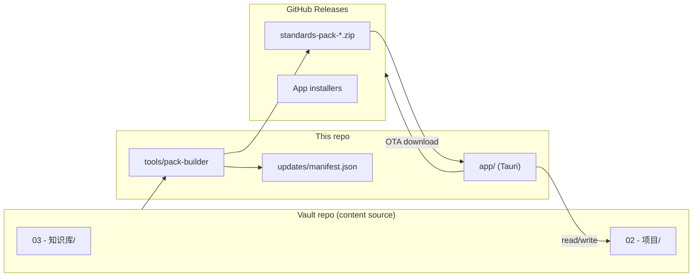
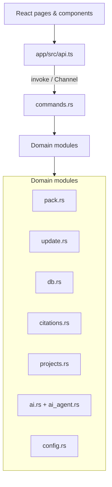
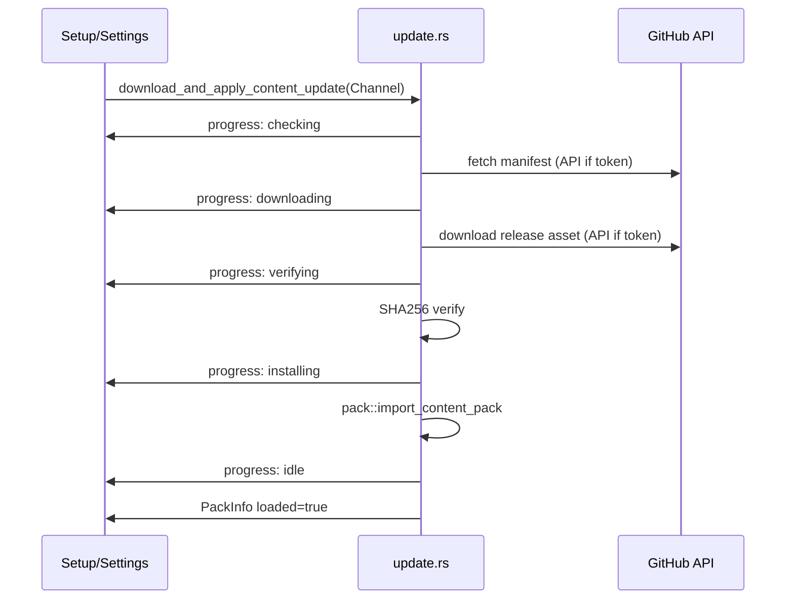

# Architecture — Accounting Copilot

Concise map for developers and agents. Full product spec: [DESIGN.md](./DESIGN.md).

## System context



## App runtime layers



## First-run vs steady state

| State | `pack.loaded` | UI |
|-------|---------------|-----|
| First install | `false` | Setup wizard (download pack) |
| Ready | `true` | Workbench + Standards tabs |

Settings (gear icon) is always available from the header.

## Update download pipeline



Key file: `app/src-tauri/src/update.rs`

## Standards data on disk (installed pack)

After import, `content/` contains:

```
content/
├── registry.json           # standards list + counts
├── pack-manifest.json
├── current/                # active standards markdown
├── archive/                # legacy standards
├── index/
│   └── paragraphs.json     # citation / paragraph index
└── writing-spec/           # AI writing guidelines
```

Search uses SQLite FTS populated from pack content (`db.rs`).

## Frontend page responsibilities

| Page | File | Role |
|------|------|------|
| Setup | `SetupPage.tsx` | Token, first download, 3-step onboarding |
| Standards | `StandardsPage.tsx` | Browse/search standards, filters |
| Workbench | `EvidencePage.tsx` | Project notes, side panel, AI threads |
| Settings | `SettingsPage.tsx` | Projects dir, AI, updates, version info |

Navigation shell: `App.tsx`.

## Tauri command surface (grouped)

| Group | Examples |
|-------|----------|
| Pack | `get_pack_info`, `paragraphs_index_loaded` |
| Updates | `check_content_updates`, `download_and_apply_content_update`, `save_update_config` |
| Standards | `list_standards`, `get_standard`, `search_standards`, `open_official_url` |
| Projects | `list_project_tree`, `read_project_file`, `create_project_folder`, … |
| Citations | `resolve_citation`, `scan_note_citations` |
| AI | `generate_project_document`, `continue_project_document`, `append_ai_conversation_turn` |
| Config | `get_config`, `save_projects_dir`, `save_ai_config` |

Full list: `app/src-tauri/src/lib.rs`.

## Monorepo packages

| Package | Path | Role |
|---------|------|------|
| `@asd/accounting-copilot` | `app/` | Tauri desktop UI |
| `@asd/pack-builder` | `tools/pack-builder/` | Build content zip |
| `@asd/shared-types` | `packages/shared-types/` | Shared TS types |

Root scripts: `package.json` → `pnpm app:dev`, `pnpm app:build`, `pnpm pack:build`.

## CI workflows

| Workflow | Trigger | Output |
|----------|---------|--------|
| `release-app.yml` | push tag `app-v*` | `.exe`, `.msi`, `.deb`, `.AppImage` |
| `build-pack.yml` | schedule / manual | `content-*` release + manifest commit |

## Extension points

| Task | Touch |
|------|-------|
| New UI feature | `app/src/pages/*`, `components/*`, `api.ts` |
| New backend capability | `src-tauri/src/*.rs`, `commands.rs`, `lib.rs` |
| New standard metadata | `standards-registry.yaml` + pack rebuild |
| Update manifest schema | `update.rs`, `models.rs`, `updates/manifest.json` |
| Filter/navigation UX | `lib/standards-navigation.ts`, `StandardsCategoryNav.tsx` |
