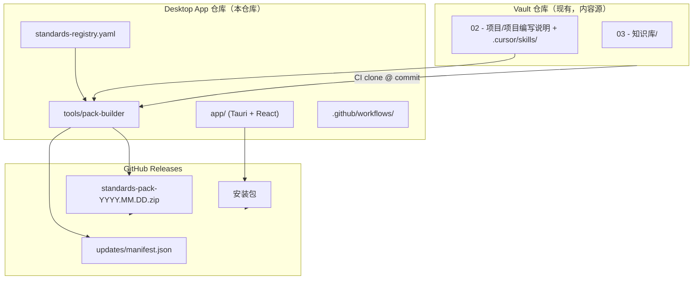
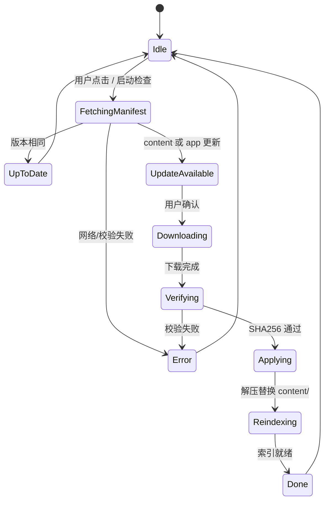

# 多分类准则桌面 App — 设计说明

> **状态**：设计稿 v1 — **已落地**（当前 App **v0.1.19**，[`app-v0.1.19`](https://github.com/MoonMaxTea/Accounting-Copilot/releases/tag/app-v0.1.19)）  
> **内容源**：[AccoutingStandards-IFRS-USGaap](https://github.com/MoonMaxTea/AccoutingStandards-IFRS-USGaap) 的 `03 - 知识库/`  
> **实现细节**：见 [ARCHITECTURE.md](./ARCHITECTURE.md)、[RELEASE-NOTES.md](./RELEASE-NOTES.md)、[AGENTS.md](../AGENTS.md)

---

## 一、产品定义

### 1.1 一句话

**离线优先的 Tauri 桌面「多分类准则证据工作台」**：全量内置 IFRS / IAS / ASC 会计准则 + HK / SEC 上市规则 + CN / DE / US / 国际税法；AI 按 Vault 规范生成本地项目文档；每条引用可对照本地原文并跳转官网二次验证；准则库通过 GitHub Releases 检查更新；旧准则留存并标「旧准则」。

### 1.2 核心能力（优先级）

| 优先级 | 能力 | 说明 |
|--------|------|------|
| P0 | 准则全量浏览 + 全文搜索 | 现行 + 旧准则 |
| P0 | Workbench 分屏 | 项目笔记 ↔ 准则段落对照 |
| P0 | 官网验证链接 | 每条准则 `official_url` |
| P0 | AI 写项目文档 | 仅引 pack 内段落；默认仅 `current` |
| P0 | 检查更新 | GitHub Releases：App + content pack |
| P1 | 旧准则标签与对照 | `legacy` 徽章、`superseded_by` 跳转 |
| P1 | 引用校验 | 生成后扫描引用是否存在于 index |
| P1 | 用户自选项目目录 | Settings → projects folder；扫描 `.md` 树 |
| P2 | 与 Vault `02 - 项目/` 目录对齐 | 可选；用户自行指定路径即可 |
| P2 | 写回 Vault PR | 可选 |

### 1.3 明确不做（v1）

- 纯 Web / SaaS 托管用户文档
- 公网托管准则全文
- 用户编辑准则 pack 内容
- 本地大模型（v1 使用云端 API，可配置 Key）

---

## 二、仓库关系



| 仓库 | 职责 |
|------|------|
| **Vault** | 准则 Markdown、项目规范、Cursor Skill；日常维护 |
| **Desktop** | UI、打包、注册表、官网 URL、Release、更新 manifest |
| **GitHub Releases** | 免费分发 App 与 content pack |

Vault 侧**可选**仅在 README 增加一行指向 Desktop 仓库，**非必须**。

---

## 三、App 仓库目录结构（建议）

```
Accounting-Copilot/
├── docs/
│   └── DESIGN.md                 ← 本文档迁移目标
├── standards-registry.yaml       ← 准则元数据（status、官网链接）
├── tools/
│   ├── pack-builder/             ← 构建 content pack
│   │   ├── main.ts
│   │   ├── paragraph-indexer.ts
│   │   └── vault-sync.ts
│   └── schema/                   ← JSON Schema 校验
├── updates/
│   └── manifest.json             ← latest 指针（或 Release 资产）
├── app/
│   ├── src/                      ← React UI
│   └── src-tauri/                ← Tauri 壳 + Rust 后端
├── writing-spec/                 ← 从 Vault 同步的编写规范副本
│   ├── 项目编写说明.md
│   └── SKILL.md
└── .github/workflows/
    ├── build-pack.yml            ← 构建 standards-pack
    └── release-app.yml           ← 构建安装包
```

---

## 四、规范 ① — `standards-registry.yaml`

### 4.1 用途

- 准则**唯一元数据源**（Desktop 仓库维护，MVP 不要求改 Vault 130+ 文件）
- 驱动：pack 内 `current/` vs `archive/` 分类、UI 徽章、官网按钮、AI 引用范围
- 构建时校验：`vault_path` 文件是否存在

### 4.2 字段定义

| 字段 | 类型 | 必填 | 说明 |
|------|------|------|------|
| `id` | string | ✅ | 稳定标识，如 `IFRS 11`、`IAS 12`、`ASC 740` |
| `title` | string | ✅ | 英文或官方标题 |
| `title_zh` | string |  | 中文标题（若有） |
| `framework` | enum | ✅ | `IFRS` \| `IAS` \| `ASC` \| `HK` \| `SEC` \| `CN` \| `DE` \| `US` \| `INTL` |
| `category` | enum |  | `accounting-standards` \| `listing-rules` \| `tax`（数据驱动，新增分类仅需 YAML + pack rebuild） |
| `status` | enum | ✅ | `current` \| `legacy` |
| `legacy_label` | string |  | 默认 `旧准则`；仅 `status: legacy` 时显示 |
| `effective_from` | date |  | ISO 8601，可选 |
| `effective_until` | date |  | 废止日；legacy 建议填 |
| `superseded_by` | string |  | 指向另一 `id`；legacy 建议填 |
| `supersedes` | string[] |  | 反向关系，可选 |
| `official_url` | url | ✅ | **官网权威链接**，UI「二次验证」用 |
| `official_url_note` | string |  | 如「需 FASB 账号登录」 |
| `vault_path` | string | ✅ | 相对 Vault 根，如 `03 - 知识库/IFRS/IFRS准则/IFRS 11 - Joint Arrangements.md` |
| `pack_filename` | string |  | 覆盖默认文件名，一般省略 |
| `tags` | string[] |  | 如 `[合营, 权益法]`，便于筛选 |

### 4.3 状态规则

| status | 打包位置 | 默认列表 | AI 默认引用 |
|--------|----------|----------|-------------|
| `current` | `current/{framework}/` | 显示 | ✅ 允许 |
| `legacy` | `archive/{framework}/` | 隐藏，可筛「含旧准则」 | ❌ 默认禁止；用户可开「对照模式」 |

**同一 `id` 仅允许一条 `current` 记录。** 若需保留同一准则的历史版本文本，使用不同 `id`：

- `IAS 12` → current  
- `IAS 12@2019` → legacy（示例，实际命名在 registry 统一）

### 4.4 官网链接约定

| framework | URL 策略 |
|-----------|----------|
| **IFRS** | `https://www.ifrs.org/issued-standards/list-of-standards/...` 或 IFRS Foundation 该准则 HTML 页 |
| **IAS** | 同上，IAS 列表页 |
| **ASC** | `https://asc.fasb.org/{topic}/showallinone` 或 Topic  landing（构建脚本可用模板 `https://asc.fasb.org/740/showallinone`） |

`official_url` **必须人工核验**，不可由构建脚本瞎猜。ASC 页面常需登录，用 `official_url_note` 提示。

### 4.5 示例

见 [examples/standards-registry.example.yaml](../examples/standards-registry.example.yaml)。

### 4.6 构建产出 `registry.json`

pack-builder 将 YAML 转为 App 只读 JSON，并附 `vault_commit`、`content_version`。  
见 [examples/registry.example.json](../examples/registry.example.json)。

---

## 五、规范 ② — `standards-pack` 与 manifest

### 5.1 ZIP 包目录结构

```
standards-pack-2026.06.18.zip
├── pack-manifest.json          # 包内清单（见 5.2）
├── registry.json               # 由 standards-registry.yaml 生成
├── writing-spec/
│   ├── 项目编写说明.md
│   └── SKILL.md
├── current/
│   ├── IFRS/
│   │   └── IFRS 11 - Joint Arrangements.md
│   ├── IAS/
│   │   └── IAS 28 - ....md
│   └── ASC/
│       └── ASC 740 - Income Taxes.md
├── archive/
│   ├── IFRS/
│   ├── IAS/
│   │   └── IAS 31 - ....md     # legacy 示例
│   └── ASC/
└── index/
    ├── paragraphs.json         # 段落锚点索引
    └── search.sqlite           # FTS 全文索引（可选预构建）
```

**全量打包**：每次 Release 的 zip 包含**当时 registry 中全部** `current` + `archive` 文件。  
更新策略：**整包替换**（MVP）；体量约 130 篇 Markdown，可接受。

### 5.2 `pack-manifest.json`（包内）

| 字段 | 类型 | 说明 |
|------|------|------|
| `content_version` | string | 如 `2026.06.18`，与 Release tag 对齐 |
| `vault_repo` | string | 源仓库 URL |
| `vault_commit` | string | 构建时 Vault HEAD |
| `built_at` | datetime | ISO 8601 |
| `counts.current` | object | `{ ifrs, ias, asc }` |
| `counts.legacy` | object | 同上 |
| `files` | array | `{ path, sha256, size_bytes }` 可省略（大包时建议保留抽样校验） |

见 [examples/pack-manifest.example.json](../examples/pack-manifest.example.json)。

### 5.3 段落索引 `index/paragraphs.json`

供引用跳转与 AI 校验。

```json
{
  "entries": [
    {
      "standard_id": "IFRS 11",
      "paragraph": "7-8",
      "paragraph_normalized": "7",
      "pack_path": "current/IFRS/IFRS 11 - Joint Arrangements.md",
      "char_start": 4200,
      "char_end": 4580,
      "snippet_en": "Joint control is the contractually agreed...",
      "status": "current"
    }
  ]
}
```

**索引规则（pack-builder）：**

1. 匹配 `Paragraph 7`、`Paragraph 7–8`、`§7`、`§7-8` 等（IFRS/IAS）
2. ASC 匹配 `740-10-25-1` 等 codification 段落号
3. 每条 index 记录必须能关联到 `registry.json` 中的 `id`

### 5.4 GitHub Release 级 `updates/manifest.json`

App 检查更新的**唯一入口**（可放在 App 仓库 main 分支，或 Latest Release 资产）。

| 字段 | 类型 | 说明 |
|------|------|------|
| `schema_version` | number | 当前 `1` |
| `content` | object | 准则包更新信息 |
| `content.latest_version` | string | `2026.06.18` |
| `content.pack_url` | url | Release 资产直链 |
| `content.pack_sha256` | string | 小写 hex |
| `content.pack_size_bytes` | number | |
| `content.release_notes` | string | Markdown /plain |
| `content.min_app_version` | string | semver |
| `app` | object | 可选，Tauri updater 信息 |
| `app.latest_version` | string | |
| `app.platforms` | object | `{ windows-x86_64: { url, signature } }` |

见 [examples/updates-manifest.example.json](../examples/updates-manifest.example.json)。

### 5.5 Release 命名约定

| 类型 | Tag 示例 | 资产 |
|------|----------|------|
| Content only | `content-2026.06.18` | `standards-pack-2026.06.18.zip` |
| App | `app-v0.1.15` | `Accounting Copilot_0.1.15_x64-setup.exe` 等 |
| 联合发版 | `app-v0.1.15+content-2026.06.24` | 两者皆有 |

**原则**：content 可独立于 app 发版；发 content 后必须更新 `updates/manifest.json` 的 `content` 段。

---

## 六、规范 ③ — App 交互与更新状态机

### 6.1 用户本地目录

| 路径 | 说明 |
|------|------|
| `{AppData}/com.moonmaxtea.accounting-copilot/content/` | 准则 pack |
| `{AppData}/com.moonmaxtea.accounting-copilot/config.json` | projects folder、更新通道等 |
| `{AppData}/com.moonmaxtea.accounting-copilot/sessions/` | AI 会话（按项目相对路径 hash） |
| `{AppData}/com.moonmaxtea.accounting-copilot/ai-debug.log` | AI 运行元数据（不含密钥/全文） |
| `{用户自选 projects_dir}/` | 项目笔记 `.md`（默认不在 AppData） |

`config.json` 示例：

```json
{
  "projects_dir": "/Users/me/Documents/AccountingProjects/02 - 项目",
  "update": {
    "manifest_url": "https://raw.githubusercontent.com/MoonMaxTea/Accounting-Copilot/main/updates/manifest.json",
    "check_on_startup": true,
    "last_content_version": "2026.06.18"
  },
  "ai": {
    "provider": "openai",
    "allow_legacy_citations": false
  }
}
```

### 6.2 检查更新状态机



**Applying 细则：**

1. 下载至 `{AppData}/Accounting Copilot/downloads/pack-{version}.zip`
2. 校验 `pack_sha256`
3. 解压到 `{AppData}/Accounting Copilot/content.new/`
4. 验证 `pack-manifest.json` + `registry.json` 可读
5. 原子替换：`content/` → `content.bak/`，`content.new/` → `content/`
6. 重建或加载 `index/search.sqlite`
7. 更新 `config.last_content_version`
8. 删除 `content.bak/`（或保留上一版供回滚，P2）

### 6.3 准则阅读 UI

**现行准则页：**

```
┌─────────────────────────────────────────────────────────┐
│ IFRS 11 — Joint Arrangements          [旧准则] (hidden) │
│ [在 IFRS 官网查看原文 ↗]  [复制链接]                      │
├─────────────────────────────────────────────────────────┤
│ 📌 中文提炼（若有）                                       │
│ 正文 Markdown 渲染…                                      │
└─────────────────────────────────────────────────────────┘
```

**旧准则页：**

```
┌─────────────────────────────────────────────────────────┐
│ ⚠ 旧准则 — 已被 IFRS 11 取代（2013-01-01），仅供对照     │
│ [查看取代准则 IFRS 11]  [在官网查看 ↗]                    │
├─────────────────────────────────────────────────────────┤
│ 正文…                                                    │
└─────────────────────────────────────────────────────────┘
```

**列表筛选：**

- 默认：仅 `current`
- 勾选「显示旧准则」：含 `archive/`
- 框架筛选：IFRS / IAS / ASC / HK / SEC / CN / DE / US / INTL（由 `category_meta` 数据驱动）

### 6.4 Workbench 分屏（Evidence）

```
┌──────────────────────┬──────────────────────┐
│ 项目笔记              │ 准则原文              │
│ （用户本地 .md）       │ （pack 内，高亮段落）  │
│                      │ [官网验证 ↗]          │
│ 点击 IFRS 11 §7-8 ────┼──► 滚动并高亮        │
└──────────────────────┴──────────────────────┘
```

- 引用格式与 Vault 项目笔记一致：`IFRS 11 §7–8`、`IAS 28 §16`、`ASC 740-10-25-5`
- 无法解析的引用：标黄「未在本地 pack 找到，请检查版本或官网」

### 6.5 项目（AI 生成项目笔记 + 历史列表）

> **产品决策（2026-06-18）**
> - 主导航命名为 **「项目」**；生成后 **直接保存**，不要求用户再点保存。
> - **历史项目**：默认按 **最近修改时间** 从新到旧；支持 **搜索**（标题 / 文件名 / 正文关键词）。
> - **新建文件名**：全自动 — `{项目名}-{YYYY-MM-DD}.md`；**项目名由 AI 根据用户问题自动生成**（用户无需填写）。

**入口：** 顶部主导航 `[Standards] [Workbench] [Settings]`（Setup 在首次安装）

**页面布局（Workbench）：**

```
┌──────────────────────┬──────────────────────────────┐
│ 历史项目              │ 新建 / 打开项目笔记           │
│ 🔍 搜索…             │ （问题输入 + Generate / Follow-up） │
│ （按最近修改排序）     │                              │
└──────────────────────┴──────────────────────────────┘
```

**历史项目列表：**

| 规则 | 说明 |
|------|------|
| 数据来源 | 扫描 Settings 中 `{projects_dir}` 下全部 `.md`（含子文件夹） |
| 默认排序 | **最近修改** 在最上（`mtime` 降序） |
| 搜索 | 匹配：文件名、笔记首个 `# 标题`、正文前 N 字；实时过滤列表 |
| 点击条目 | 在 Workbench 分屏打开 / 打开所在文件夹 |
| 索引文件 | 若存在 `项目索引.md`，新建后追加内部链接；**列表排序仍以最近修改为准** |

**新建 — 输入：** 用户问题 + 可选事实表（如 50:50 合营）

**新建 — 项目名与文件名（全自动）：**

1. AI 根据用户问题生成 **短项目名**（2–12 字为宜，如 `合营安排判断`、`ASC740递延所得税`）
2. 文件名：`{项目名}-{YYYY-MM-DD}.md`（例：`合营安排判断-2026-06-18.md`）
3. 同日重名：追加序号，如 `合营安排判断-2026-06-18-2.md`
4. 笔记正文首个一级标题 `# …` 与项目名一致（便于搜索与列表显示）

**System 约束（摘自 Vault）：**

- `writing-spec/项目编写说明.md`
- `writing-spec/SKILL.md`
- 只允许引用 `index/paragraphs.json` 中且 `status === current` 的条目（除非 `allow_legacy_citations`）

**输出与保存：**

- 生成完成后，**自动写入** `{projects_dir}/{项目名}-{YYYY-MM-DD}.md`
- 保存成功后提示路径；Workbench 自动刷新项目树
- 自动更新 `项目索引.md`（若存在）

**生成后校验（不阻断保存，仅提示）：**

| 检查 | 失败处理 |
|------|----------|
| 引用存在于 paragraphs.json | 标红警告；文件仍已保存 |
| 中文提炼未标成「原文」 | 警告 |
| B-实务决策 缺操作结论 | 警告 |

**追问（Follow-up / Continue，v0.1.14）：**

- 在同一 `.md` 上追加用户问题；Rust 读取**全文笔记**后进入 Agent Continue（`agent_continue`）
- Generate 与 Continue **同一引擎**：`run_standards_agent` + 3 工具，最多 12 轮
- 每文件独立会话：`sessions/<sha256(relative_path)>.json`
- Windows 0.1.14 修复：`relative_project_path` 在 canonical 根路径上计算相对路径

**后续修改：** 用户可在任意编辑器改稿；改后按 **最近修改** 浮到历史列表顶部。

### 6.6 设置页 — 版本信息

```
准则库版本：2026.06.18
Content pack commit：（pack-manifest）
App 版本：0.1.15
上次检查更新：2026-06-22 10:00
[Check for updates]
```

（产品 UI 为英文；上图为信息结构示意。）

### 6.7 AI 生成架构（v0.1.15）

| 操作 | Tauri 命令 | Rust 入口 | Debug mode |
|------|------------|-----------|------------|
| 新建 Generate | `generate_project_document` | `run_standards_agent` Create | `agent_create` |
| 追问 Continue | `continue_project_document` | `run_standards_agent` Continue | `agent_continue` |

**工具（3）：** `search_local_pack`、`list_standard_paragraphs`、`get_pack_paragraph`

**跨轮 API：** 每轮仅发送 `[system, current_user_turn]`；不 replay 旧 `tool` 行。Continue 在 user turn 嵌入全文 `.md`，当前轮重新跑工具检索。

**后处理（不变）：** `parse_ai_response` → `inject_pack_quotes`（≤600 字 cap）→ frontmatter / 日志 / 免责声明 → 写盘。

**可观测性：** `ai-debug.log` 记录 `continue_requested` → `continue_enter_ai` → `agent_continue`；失败时 `continue_failed_before_ai` + `error_class`。

详见 [ARCHITECTURE.md](./ARCHITECTURE.md) 与 [RELEASE-NOTES.md](./RELEASE-NOTES.md#app-v0114-2026-06-22)。

---

## 七、构建流水线

### 7.1 `build-pack` 工作流（触发）

| 触发 | 动作 |
|------|------|
| 手动 `workflow_dispatch` | 指定 Vault ref |
| 定时 weekly | clone Vault `@ main` |
| Vault 仓库 `repository_dispatch`（可选，Vault 零改动则不用） | |

**步骤：**

1. Checkout Desktop 仓库  
2. Clone Vault `@ vault_ref` 至 `/tmp/vault`  
3. 读取 `standards-registry.yaml`，校验 `vault_path`  
4. 复制 Markdown → `current/` / `archive/`  
5. 复制 `writing-spec/`（从 Vault `02 - 项目/项目编写说明.md` + `.cursor/skills/.../SKILL.md`）  
6. 生成 `paragraphs.json`、`search.sqlite`  
7. 生成 `pack-manifest.json`、`registry.json`  
8. 打 zip，计算 SHA256  
9. 创建 GitHub Release `content-{date}`  
10. 更新 `updates/manifest.json` 并 commit（或作为 Release 说明）

### 7.2 与 Vault 的同步约定

| 项目 | 约定 |
|------|------|
| 准则正文 | **仅**来自 Vault `03 - 知识库/`，pack-builder 不得改正文 |
| 元数据 | Desktop 仓库 `standards-registry.yaml` |
| 编写规范 | 每次 build 从 Vault 复制最新 `项目编写说明` + SKILL |
| 项目笔记 | **不**打入 pack；仅存用户 `projects_dir` |

---

## 八、版本与旧准则运维

### 8.1 新增 / 修订现行准则

1. 在 Vault 更新 Markdown  
2. 在 `standards-registry.yaml` 确认条目为 `status: current`  
3. 触发 `build-pack` → 新 Release  

### 8.2 准则废止 → 旧准则

1. Vault **保留**旧文件（或移入 Vault 内 `archive` 子目录，若将来 Vault 也做 archive）  
2. registry：原条目改 `status: legacy`，填 `superseded_by`、`effective_until`  
3. 新准则新增 `current` 条目  
4. 重建 pack：旧文件进 `archive/`，新文件在 `current/`  

### 8.3 用户侧对照

- 项目笔记引用旧准则时，Evidence 面板显示「旧准则」横幅  
- 可一键打开 `superseded_by` 现行准则同段落（若 paragraph 可映射，P2）

---

## 九、版权与合规（产品层）

- 准则全文随 **Desktop 安装包 / content pack** 分发，不提供独立公开下载页  
- README 与关于页声明：内容版权归 IFRS Foundation / FASB 所有；用户应在官网二次验证  
- `official_url` 为**必备**，强化「本地便利 + 官网权威」双层证据  
- 若未来商业化，需另行评估许可；当前按**免费 + GitHub Releases** 设计  

---

## 十、实施阶段

| 阶段 | 交付 | 状态 |
|------|------|------|
| **Phase 0** | `standards-registry.yaml` 首版；pack-builder CLI | ✅ |
| **Phase 1** | Tauri 壳 + 准则浏览 + 搜索 + 官网链接 + 旧准则 UI | ✅ |
| **Phase 2** | Workbench 分屏 + 本地项目目录 | ✅ |
| **Phase 3** | AI Agent 写文档 + 引用校验 + Follow-up | ✅（v0.1.15） |
| **Phase 4** | GitHub Release 自动更新 + 设置页 | ✅ |

---

## 十一、附录文件

| 文件 | 说明 |
|------|------|
| [examples/standards-registry.example.yaml](../examples/standards-registry.example.yaml) | 注册表示例 |
| [examples/registry.example.json](../examples/registry.example.json) | 构建产出示例 |
| [examples/pack-manifest.example.json](../examples/pack-manifest.example.json) | 包内 manifest |
| [examples/updates-manifest.example.json](../examples/updates-manifest.example.json) | 更新检查 manifest |

---

## 日志

- 2026-06-18：初稿 — 桌面 Only、GitHub Releases、全量 pack、旧准则、官网链接、AI 写文档
- 2026-06-18：迁移至 Accounting-Copilot 仓库；registry 130 条骨架
- 2026-06-21：Agent-only 生成；pipeline 模式移除（v0.1.13）
- 2026-06-22：**v0.1.14** — Windows Continue 路径修复；`ai-debug.log` 诊断；产品 UI 去除第三方编辑器名称
- 2026-06-24：**v0.1.15** — 多分类准则导航（会计准则 / 上市规则 / 税法）；三项 UX 修复（进度条动画、引用摘录折叠、对话日志可见性）；文档清理
