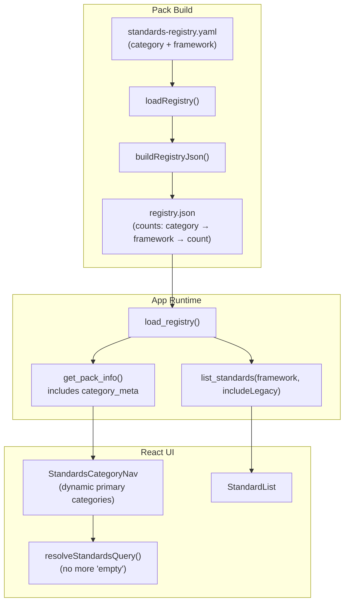

# Multi-Category Standards Navigation — Design Spec

Date: 2026-06-24 | Status: Draft | Scope: Pack builder + Backend models + Frontend navigation

## 1. Motivation

The current standards browser supports only Accounting Standards (IFRS/IAS/ASC). The UI has a "Listing Rules" placeholder that always shows "coming soon" because the data pipeline cannot encode non-accounting content. This spec enables the standards browser to display multiple content categories (Accounting Standards, Listing Rules, Tax Law, International Tax, and future categories). The navigation engine is data-driven: adding a new category requires only YAML entries and a pack rebuild — no code changes except for **display labels** (i18n) and **framework validation** (one-line shared-types enum update per new framework value).

Key constraint: **Zero visual changes to existing UI.** The breadcrumb bar, filter dropdowns, standard list, and detail panel must look and behave identically to today.

## 2. Data Model: The `category` Field

A new optional `category` field is added to `standards-registry.yaml` entries:

```yaml
- id: IFRS 3
  title: Business Combinations
  category: accounting-standards    # value determines which top-level tab it appears under
  framework: IFRS
  status: current
  vault_path: 03 - 知识库/IFRS/IFRS准则/IFRS 3 - Business Combinations.md
```

```yaml
- id: HK LR 1
  title: 上市规则第1章
  category: listing-rules
  framework: HK
  status: current
  vault_path: 03 - 知识库/HK Listing Rules/上市规则第1章.md
```

All existing entries receive `category: accounting-standards`. New entries for listing rules and tax law receive the appropriate category value.

### Allowed Values

| category value | Display (EN) | Display (ZH) | framework values |
|---|---|---|---|
| `accounting-standards` | Accounting Standards | 会计准则 | IFRS, IAS, ASC |
| `listing-rules` | Listing Rules | 上市规则 | HK, SEC |
| `tax` | Tax Law | 税法 | CN, DE, US, ... |
| _(future)_ | _(arbitrary)_ | _(i18n fallback)_ | _(arbitrary)_ |

Categories are not hardcoded in the codebase. The frontend discovers available categories from the pack data at runtime. Unknown categories render their raw `category` value as a label.

## 3. Refactored Architecture



### Key Design Principle

The backend already supports filtering by any `framework` string. The `list_standards` command does:

```rust
.filter(|record| {
    framework.as_ref().is_none_or(|value| record.framework.eq_ignore_ascii_case(value))
})
```

This means adding `framework: HK` to the registry and calling `list_standards(Some("HK"), false)` will return HK listing rules — zero backend changes required for filtering.

### Constraints

1. **Framework values must be globally unique across all categories.** Two categories cannot share the same framework value (e.g. if both `listing-rules` and `international-tax` used `INTL`, `list_standards(Some("INTL"))` would return standards from both categories). Currently satisfied: IFRS/IAS/ASC ≠ HK/SEC ≠ CN/DE/US/INTL.

2. **Secondary navigation values = framework values (uppercase).** The current codebase uses lowercase secondary keys (`ifrs`, `us-gaap`, `hk`, `us`). After this change, secondary values match framework values exactly: `IFRS`, `IAS`, `ASC`, `HK`, `SEC`, `CN`, `DE`, `INTL`. This eliminates case mismatch bugs.

3. **IFRS/IAS grouping is hardcoded domain knowledge.** Under the `accounting-standards` primary category, when secondary = `IFRS` and tertiary = `ALL`, `resolveStandardsQuery` includes both `IFRS` and `IAS` standards. This grouping rule is accounting-specific and stays hardcoded in `resolveStandardsQuery`.

## 4. File-by-File Changes

### 4.1 `standards-registry.yaml` — Add category to all entries

- Add `category: accounting-standards` to all 100 existing entries.
- Add new entries for HK listing rules, SEC rules, CN tax law, etc. with their respective categories.

### 4.2 `packages/shared-types/src/index.ts` — Relax framework + add category

**Change 1:** Expand `FrameworkSchema`:
```typescript
// Before
export const FrameworkSchema = z.enum(['IFRS', 'IAS', 'ASC']);

// After
export const FrameworkSchema = z.enum([
  'IFRS', 'IAS', 'ASC',       // accounting-standards
  'HK', 'SEC',                 // listing-rules
  'CN', 'DE', 'US', 'INTL',   // tax
]);
```

**Change 2:** Add `category` to `RegistryEntrySchema`:
```typescript
category: z.string().optional(),
```

### 4.3 `tools/pack-builder/src/pack-writer.ts` — Dynamic counts + category serialization

**Change 1:** Replace `countByFramework` with `countByCategory`:

**Before:** `countByFramework` returns `{ ifrs: number, ias: number, asc: number }` — hardcoded keys.

**After:** Replace with a generic `countByCategory` that returns `Record<string, Record<string, number>>`:

```typescript
function countByCategory(
  files: CopiedStandardFile[],
): Record<string, Record<string, number>> {
  const counts: Record<string, Record<string, number>> = {};
  for (const file of files) {
    const category = file.entry.category ?? 'accounting-standards';
    counts[category] ??= {};
    counts[category][file.entry.framework] = (counts[category][file.entry.framework] ?? 0) + 1;
  }
  return counts;
}
```

The `registry.json` `counts` changes from:
```json
{ "counts": { "current": { "ifrs": 17, "ias": 22, "asc": 53 }, "legacy": { ... } } }
```
to:
```json
{
  "counts": {
    "current": {
      "accounting-standards": { "IFRS": 17, "IAS": 22, "ASC": 53 },
      "listing-rules": { "HK": 3, "SEC": 5 },
      "tax": { "CN": 1 }
    },
    "legacy": { ... }
  }
}
```

**Change 2:** Apply the same `countByCategory` to `pack-manifest.json` (`writePack()` at `pack-writer.ts:162-163`). Currently `pack-manifest.json` writes the same `countByFramework` output. Both files use the same nested `category → framework → count` structure.

**Change 3:** Include `category` in `buildRegistryJson()` standards array. Currently `buildRegistryJson` only maps `RegistryEntry` → `{ id, framework, title, status }`. Add `category: entry.category ?? null` to the mapping.

### 4.4 `app/src-tauri/src/models.rs` — Rust data structures

**`StandardRecord`** — add `category`:
```rust
pub category: Option<String>,
```

**`StandardSummary`** — add `category`:
```rust
pub category: Option<String>,
```

**`From<&StandardRecord> for StandardSummary`** — include category in mapping.

**`RegistryCounts` / `FrameworkCounts`** — replace fixed structs with dynamic maps:
```rust
// Before
pub struct FrameworkCounts {
    pub ifrs: u32,
    pub ias: u32,
    pub asc: u32,
}
pub struct RegistryCounts {
    pub current: FrameworkCounts,
    pub legacy: FrameworkCounts,
}

// After
pub type CategoryCounts = std::collections::HashMap<String, std::collections::HashMap<String, u32>>;
pub struct RegistryCounts {
    pub current: CategoryCounts,
    pub legacy: CategoryCounts,
}
```

**`PackInfo`** — add `category_meta` to carry display metadata:
```rust
pub category_meta: Option<Vec<CategoryMeta>>,
```
where `CategoryMeta` is:
```rust
pub struct CategoryMeta {
    pub id: String,
    pub frameworks: Vec<String>,
}
```

Populated in `pack_info_from_dir` by scanning the counts map keys. **When `counts` is `None` (pack not loaded), set `category_meta: None`.**

### 4.5 `app/src/types.ts` — Frontend types

**`StandardSummary`** — add `category`:
```typescript
category: string | null;
```

**New `CategoryMeta` type:**
```typescript
export interface CategoryMeta {
  id: string;
  frameworks: string[];
}
```

**`PackInfo`** — add `category_meta`:
```typescript
category_meta: CategoryMeta[] | null;
```

**`FrameworkFilter`** — expand to accept any framework value:
```typescript
// Before
export type FrameworkFilter = "ALL" | "IFRS" | "IAS" | "ASC";

// After
export type FrameworkFilter = "ALL" | string;
```

### 4.6 `app/src-tauri/src/commands.rs` — No filter logic changes

`list_standards` already does string-based framework filtering. No changes needed.

`get_pack_info` already reads `registry.counts` from `PackInfo`. The `counts` type changes are transparent to this function because `RegistryCounts` remains its return type (with the new fields). Only the `PackInfo` construction in `pack.rs` needs updating to populate `category_meta`.

### 4.7 `app/src/lib/standards-navigation.ts` — Core rewrite

This is the largest change. The file transforms from hardcoded enums to data-driven navigation.

**Primary/secondary value conventions (breaking):**

- **Primary** values are category IDs from pack data: `accounting-standards`, `listing-rules`, `tax`.
- **Secondary** values are framework values (uppercase): `IFRS`, `IAS`, `ASC`, `HK`, `SEC`, `CN`, `DE`, `INTL`.
- The legacy lowercase convention (`ifrs`, `us-gaap`, `hk`, `us`) is replaced.

**Key changes:**

1. Accept `CategoryMeta[]` as input to generate navigation options dynamically.
2. Remove `StandardsPrimaryCategory` / `StandardsSecondary` hardcoded types — these become runtime values derived from pack data.
3. `resolveStandardsQuery` stops returning `"empty"` for listing-rules — it generates proper queries for all categories.
4. `navigationForStandard(standard)` looks up `category_meta` to find which primary category contains the standard's framework, then uses that framework as secondary. Example: standard with `framework: "HK", category: "listing-rules"` → primary=`listing-rules`, secondary=`HK`.
5. `resolveStandardsQuery` hardcoded rule: when `primary = accounting-standards + secondary = IFRS + tertiary = ALL`, the query includes both `IFRS` and `IAS` standards. This grouping is accounting-domain-specific and cannot be derived from pack data alone.
6. `tertiaryOptions` — accounting-standards keeps IFRS/IAS/ASC; other categories return empty (no tertiary). This is intentional MVP behavior.
7. `defaultSecondary` / `defaultTertiary` — selected the first available option for each category.

**New export:**
```typescript
export function buildPrimaryCategories(meta: CategoryMeta[]): StandardsNavOption<string>[] {
  return meta.map((item) => ({
    id: item.id,
    label: item.id, // i18n happens at render time via navLabel()
  }));
}
```

**Secondary options per primary:**
```typescript
export function secondaryOptionsForCategory(
  primary: string,
  meta: CategoryMeta[],
): StandardsNavOption<string>[] {
  const cat = meta.find((item) => item.id === primary);
  return (cat?.frameworks ?? []).map((fw) => ({ id: fw, label: fw }));
}
```

### 4.8 `app/src/lib/i18n.ts` — New labels

Add `navLabel` cases for new category and framework values:

| id | EN | ZH |
|---|---|---|
| `accounting-standards` | Accounting Standards | 会计准则 |
| `listing-rules` | Listing Rules | 上市规则 |
| `tax` | Tax Law | 税法 |
| `HK` | HK | 香港 |
| `SEC` | SEC | 美国SEC |
| `CN` | CN | 中国大陆 |
| `DE` | DE | 德国 |
| `INTL` | International | 国际 |

Unknown values render as raw strings (current behavior).

### 4.9 `app/src/pages/StandardsPage.tsx` — Data-driven initialization

Key changes:
- Read `category_meta` from `PackInfo`, pass to navigation functions
- Initialize `primary` from the first available category (defaults to `accounting-standards`)
- Remove hardcoded empty state for listing-rules — all categories can have content now

### 4.10 `app/src/components/StandardsCategoryNav.tsx` — Props updated

Changes:
- `primary` type changes from `StandardsPrimaryCategory` to `string`
- `secondary` type changes from `StandardsSecondary` to `string`
- Accept `categoryMeta: CategoryMeta[]` prop to generate options dynamically
- `includeLegacy` checkbox: visible only when primary === `accounting-standards`

### 4.11 `app/src/context/PreferencesContext.tsx` — (if needed)

`packInfo` is already passed through context. The `PackInfo` type gains `category_meta`. Ensure `get_pack_info` API call returns the new field.

### 4.12 `app/src/api.ts` browser mock — Update MOCK_PACK_INFO

`MOCK_PACK_INFO` at `api.ts:39-42` has hardcoded counts: `{ current: { ifrs: 18, ias: 32, asc: 90 }, ... }`. Update to the nested `category → framework → count` format matching the new `RegistryCounts` / `PackInfo` shape. Add `category_meta: []` placeholder.

---

## 5. Before / After Comparison

| Aspect | Before | After |
|---|---|---|
| Navigation categories | Hardcoded: ["accounting-standards", "listing-rules"] | Dynamic: read from pack `category_meta` |
| `framework` values | 3: IFRS, IAS, ASC | 8+: IFRS, IAS, ASC, HK, SEC, CN, DE, INTL, ... |
| Listing Rules content | Always empty ("coming soon") | Real data from registry |
| Taxonomy support | None | Any framework + category combination |
| Adding a new category | Requires code changes + app release | Add entries to YAML, rebuild pack |
| Pack `registry.json` counts | Fixed `{ifrs, ias, asc}` | Nested: `category → framework → count` |

## 6. Backward Compatibility

- All existing YAML entries receive `category: accounting-standards` — no behavior change for current content.
- `framework` and `status` fields are unchanged.
- Pack file structure (current/IFRS/, current/ASC/) is unchanged — `resolvePackPath` already uses `entry.framework` directly.
- Old packs (without `category` field in registry.json) are handled: `category` defaults to `null`, frontend treats `null` as `accounting-standards`.

## 7. Non-Goals (Out of Scope)

- No changes to citation resolution, paragraph indexing, or AI agent prompts.
- No changes to the Settings page or update flow.
- No changes to Evidence page or project management.
- No visual redesign of the standards browser.
- No integration of actual listing rule / tax law content — only the data pipeline and navigation.
- `includeLegacy` checkbox remains visible only for the `accounting-standards` primary category. Other categories do not have a legacy/current distinction.
- Tertiary filters (framework sub-selection) remain `accounting-standards` only. Tax law and listing rules use secondary-level framework selection only.
- The `FrameworkSchema` closed enum accepts a one-line code change per new framework value. Full `z.string()` relaxation is deferred to a future iteration.

## 8. Testing

- `pnpm test` (pack-builder + shared-types + app vitest)
- `cd app/src-tauri && cargo test`
- Manual: verify old packs still load correctly
- Manual: verify navigation categories appear dynamically from pack data
- Manual: verify listing-rules and tax categories show standards when populated

## 9. Deputy Review & Lead Decisions (2026-06-24)

Deputy (Claude Code) performed a critical design review. 12 findings. Lead decisions below.

| # | Finding | Severity | Decision | Rationale |
|---|---------|----------|----------|-----------|
| 1 | Default category: `accounting-standards` vs `"other"` bucket | High | **Partially accept** | Keep `accounting-standards` as default. All 100+ existing entries will have explicit `category: accounting-standards`. The `?? 'accounting-standards'` fallback (was `?? 'other'`) is only for truly missing entries in YAML — a safety net, not a routing decision. |
| 2 | `pack-manifest.json` counts not addressed | High | **Accept** | Extended spec §4.3 to apply same `countByCategory` to both `registry.json` and `pack-manifest.json`. `pack.rs:31-35` only validates JSON structure, not specific keys, so no Rust changes needed. Consistency prevents confusion. |
| 3 | `FrameworkSchema` remains closed enum | High | **Partially accept** | Keep closed enum for type safety. Softened spec §1 claim: new frameworks require a one-line shared-types enum update (not "zero code changes"). `z.string()` relaxation deferred to future iteration (see §7). |
| 4 | `navigationForStandard()` rewrite underspecified | High | **Accept** | Added explicit design to §4.7: secondary values = framework values (uppercase). `navigationForStandard` maps framework → primary via `category_meta` lookup. Documented case mismatch resolution (legacy lowercase → uppercase). |
| 5 | `browser-mock.ts` MOCK_PACK_INFO not in scope | Med | **Accept** | Added as §4.12. Update mock counts to nested format + `category_meta: []`. |
| 6 | i18n contradicts "no hardcoding" principle | Med | **Reject** | Labels belong in the app, not the data. Adding `label_en`/`label_zh` to pack data couples content to UI. The spec's "data-driven" claim refers to navigation logic (which categories appear), not display labels. New categories require expected i18n code changes. |
| 7 | `tertiaryOptions` still partially hardcoded | Med | **Reject** | Intentional MVP design. Tax law organizes by country at the secondary level (CN/DE/US); tertiary would be over-engineering. Documented as known limitation in §7. |
| 8 | `resolveStandardsQuery` IFRS/IAS grouping logic hardcoded | High | **Accept** | Added as §3 Constraint #3. This is accounting-domain-specific knowledge and cannot be derived from pack data. Keep hardcoded rule in `resolveStandardsQuery`. |
| 9 | `includeLegacy` hardcoded to `accounting-standards` | Low | **Accept** | Documented in §7 Non-Goals. Other categories have no legacy/current distinction. |
| 10 | `list_standards` doesn't filter by category — frameworks must be globally unique | Med | **Accept** | Added as §3 Constraint #1. All current framework values are uniquely assigned to single categories. |
| 11 | `category_meta` when `counts` is `None` | Low | **Accept** | Added to §4.4: `pack_info_from_dir` sets `category_meta: None` when counts is `None`. |
| 12 | `buildRegistryJson` missing `category` in standards array | High | **Accept** | Added as §4.3 Change 3: serialize `category: entry.category ?? null` in `buildRegistryJson()` mapping. |

**Summary:** 9 accepted/partially accepted (spec updated), 2 rejected (i18n labels, tertiary options — intentional design decisions), 1 low-severity documented. Spec is ready for User confirmation before Phase B implementation.
